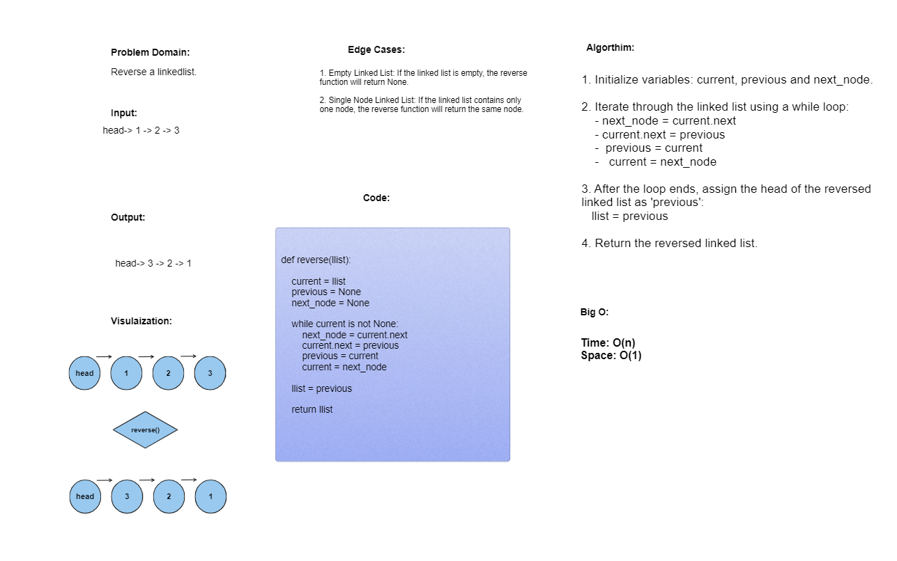
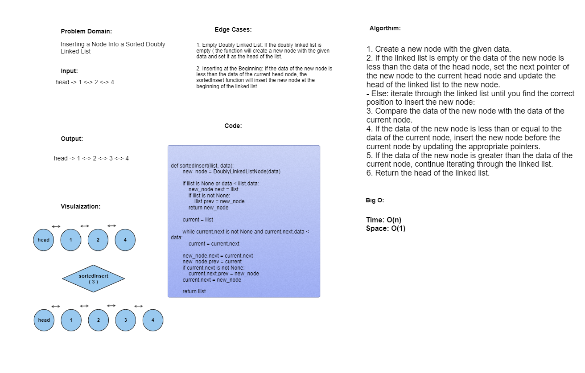

# Lab Class 36: Whiteboard-Practice
Practicing for the whiteboard interview.

## Whiteboard process:

1. Reverse a linkedlist:


2. Insert in a doubly linkedlist:


## Time / Space Complexity:

1. Reverse a linkedlist:
```
Time: O(n) / Space: O(1)
```

2. Insert in a doubly linkedlist:
```
Time: O(n) / Space: O(1)
```

## Questions Links:

1. Reverse a linkedlist: [Here!](https://www.hackerrank.com/challenges/reverse-a-linked-list/problem?isFullScreen=true)

2. Insert in a doubly linkedlist: [Here!](https://www.hackerrank.com/challenges/insert-a-node-into-a-sorted-doubly-linked-list/problem?isFullScreen=true)

